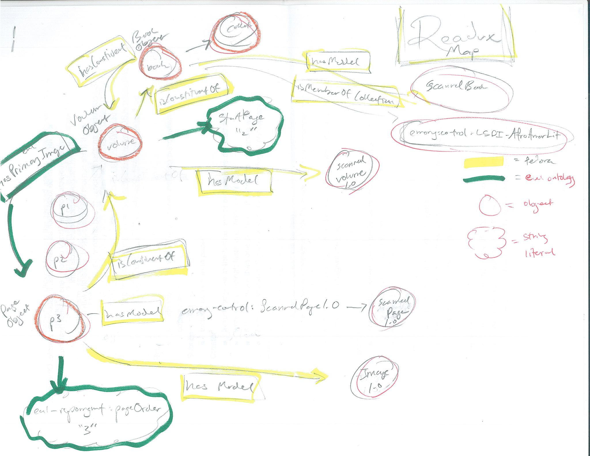

# Overview

[Readux](https://github.com/emory-libraries/readux) is an application from Emory University for reading, annotating, and interacting with digitized texts.

We have worked with them to extend Readux to work with texts digitized here at Wayne State.

## Approach

At this early stage, the approach has been to create "proxy" or "virtual" objects that Readux is accustomed to.  These proxy objects contain point to datastreams from our original ebook objects, but duplicate only in the case of small, text-based datastreams; large images are not duplicated.  This results in a many new proxy objects, but very little (to none) increase in disk usage.

## Installation

See the [deploy documentation](deploy.md) for installation instructions.

## Troubleshooting

See the [troubleshooting documentation](troubleshooting.md) for troubleshooting help.

